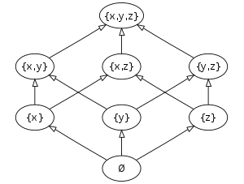
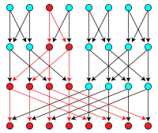
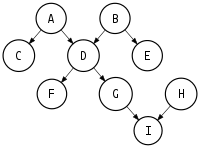

# 유향 비순환 그래프(DAG, Directed Acyclic Graph)

Reference

- [Wikipedia DAG](https://en.wikipedia.org/wiki/Directed_acyclic_graph)
- [Wikipedia Chromatic Polynomial](https://en.wikipedia.org/wiki/Chromatic_polynomial)

명칭

- directed acyclic graphs
- acyclic directed graphs
- acyclic diagprahs

- 정의
    - 그래프는 vertex(node)와 vertex(node)를연결하는 edge로 구성되며 vertex는 edge에 의해 쌍으로 연결될 수 있는 객체가 될 수 있다.
    - 방향성 그래프는 각 edge가 한 vertex에서 다른 vertex로의 방향성을 가진다.
    - 방향성 그래프에서 경로는 각 edge의 종료 vertex가 다음 edge의 시작 vertex와 같다는 특징을 가진다.
    - cycle(순환)은 처음 edge의 시작 vetex와 마지막 edge의 종료 vertex와 같음을 말한다.
    - DAG는 cycle이 없는 방향성 그래프를 말한다.
    
    
    
- 수학적 특징
    - **Reachability relation**
        
        DAG의 reachability relation은 vertex의 부분 순서( $\leq$ )로 표현할 수 있다.
        
        두 vertex u와 v가 $\text{u}\leq\text{v}$와 같은 순서를 가진다면 DAG에서 u에서 v로의 직접적인 경로가 존재한다는 뜻이며, u가 v에 도달할 수 있다고 얘기한다.
        
        $\text{u}\rightarrow\text{v}$ 와 $\text{v}\rightarrow\text{w}$ 두 가지 edge를 가진 DAG의 reachability relation는 다음 세 가지 edge( $\text{u}\rightarrow\text{v}$, $\text{v}\rightarrow\text{w}$, $\text{u}\rightarrow\text{w}$ )를 가진 DAG의 reachability realation와 같다. 두 DAG는 같은 $\text{u}\leq\text{v}\leq\text{w}$ 부분 순서를 가진다. (추이적 관계)
        
    - **Transitive closure**
        
        DAG의 transitive closure는 가장 많은 edge가 DAG와 같은 reachability realtion 를 가지는 그래프를 말한다. 이는 DAG의 reachability realtion의 covering relation에서 모든 vertex 쌍 (u,v)에 대해 $\text{u}\rightarrow\text{v}$ edge를 가지므로, graph-theoretic term으로 reachability relation의 직접적인 변환으로 생각할 수 있다. 
        
        DAG로의 부분 순서 변환의 같은 방법은 더 일반적으로 작용한다. 모든 유한 부분 순서 집합 $\text{( S, }\leq\text{ )}$에 대해 S의 모든 원소를 위한 vertex를 가지고 $\leq$ 의 모든 원소 쌍의 edge를 가지는 그래프는 자동으로  transitively closed DAG가 되고, $\text{( S, }\leq\text{ )}$를 reachability relation으로 가진다. 이런 방법으로 모든 유한 부분 순서 집합은 DAG로 표현될 수 있다. 
        
        reachability matrix를 말함
        
        |  | a | b | c | d | e |
        | --- | --- | --- | --- | --- | --- |
        | a | 1 | 0 | 0 | 0 | 0 |
        | b | 1 | 1 | 0 | 0 | 0 |
        | c | 1 | 0 | 1 | 0 | 0 |
        | d | 1 | 1 | 1 | 1 | 0 |
        | e | 1 | 1 | 1 | 1 | 1 |
    - **Transitive reduction**
        
         DAG의 transitive reduction은 가장 적은 edge가 DAG와 같은 reachability relation을 가지는 그래프를 말한다. 이는 DAG의 reachability relation $\leq$ 의 covering relation에서 모든 vertex 쌍 (u, v)에 대해 edge $\text{u}\rightarrow\text{v}$를 가지며, DAG의 subgraph로 $\text{u}\rightarrow\text{v}$를 무시하는 형태로 u에서 v로의 더 긴 경로를 가지는 DAG가 된다.
        
        transitive closure처럼 transitive reduction은 DAG에 따라 유일하게 정의된다. 반대로 순환이 있는 유향 그래프에서는 같은 reachability relation을 가진 subgraph가 최소 하나 이상 존재한다.
        
        transitive reduction은 같은 순설를 나타내는 다른 그래프에 비해 더 적은 edge를 가지기 때문에 더 간단히 그래프를 그릴 수 있게 되므로 그들이 나타내는 부분 순서를 시각화 하기에 용이하다.
        
        부분 순서의 Hasse diagrm은 edge의 시작 vertex를  종료 vertex보다 아래에 위치시켜 모든 edge의 방향을 보여주는 transitive reduction의 그림이다.
        
        
        
        transitive reduction
        
        
        
        Hasse diagram
        
    - **Topological ordering**
        
        유향 그래프의 topological ordering은 모든 edge에 대해 시작 vertex는 종료 vertex보다 먼저 나타나는 것처럼 순서 속에서 그 vertex들의 순서를 말한다. topological ordering을 가지는 그래프는 순환의 가장 빠른 vertex 에서 edge는 잘못된 방향을 가지기 때문에, 어떤 순환성도 가지지 못한다. 그러므로, 모든 topological ordering 그래프는 비순환성을 가진다.
        
        반대로 모든 DAG는 최소한 하나의 topolocial ordering을 가진다. 때문에, topolocical ordering의 존재는 DAG의 정의와 같은 의미로 사용될 수 있다. 
        
        일반적으로, DAG가 유일한 topolocial ordering를 가진다는 건 모든 vertex를 포함하는 경로를 포함한다는 말이기 때문에, 이런 순서는 유일하지 않다.
        
        DAG의 topological ordering 가족은 DAG를 위한 reachability realtion의 linear extension의 가족과 같다. 그래서 같은 부분 순서를 나타내는 두 그래프는 같은 topological order 집합을 갖는다.
        
    - **Related families of graphs**
        - Multitree (strongly unambiguous graph, mangrove)
            
            어떤 두 vertex 사이에 최대 하나의 유향 경로가 있는 DAG로, undirected tree를 포함해 어떤 vertex 로부터 도달할 수 있는 subgraph와 동일한 DAG를 얘기한다.
            
            
            
        - Polytree (directed tree)
            
            undirected tree에 방향성을 가진 형태의 multitree이다.
            
            
            
        - arboresence
            
            arboresence의 root라고 하는 특정 vertex로부터 undirected tree의 edge를 향해 형성된다.
            
- Computational problems
    - Topological sorting and recognition
        
        Topological sorting은 주어진 DAG의 topological ordering을 찾는 알고리즘적 문제로 선형 시간내에 해결한 수 있다. topological sorting을 위한 Kahn의 알고리즘은 vertex ordering을 직접적으로 설계한다. 이는 아직 부분적으로 설계된 topological ordering에 포함되지 않은 다른 vertex로부터 들어오는 edge가 없는 vertex들의 리스트를 유지한다.
        
        처음에, 들어오는 edge가 없는 모든 vertex로 구성된다. 
        이 후 반복적으로 해당 리스트의 끝에서부터 vertex를 하나씩 추가한다.
        해당 vertext의 이웃들이 리스트에 추가되야 하는 지 확인한다.
        모든 vertex들이 이런 방식으로 처리되면 알고리즘을 종료한다.
        
        다른 방식으로 dfs 그래프 탐색의 postorder numbering을 반대로 진행해 topological ordering을 구성하는 방법이 있다. 
        
    - Construction from cyclic graphs
        
        어떤 무향 그래프는 이전 종료점에서 다음 종료점으로의 모든 방향성 edge와 vertex들에 대해 전체 순서를 선택해 DAG로부터 만들 수 있다.  edge들의 방향성 결과를 acyclic orientation이라고 한다. 다른 전체 순서는 같은 acyclic orientation을 유도할 수 있으며, 때문에 n-vertex 그래프는 n! acyclic orientation보다 적을 수 있다. acyclic orientation의 수는 $|\chi(-1)|$과 같으며 $\chi$는 주어진 그래프의 chromatic polonomial 이다. 
        
        [Chromatic polynomial](https://www.notion.so/Chromatic-polynomial-b54bf7130118422690d9fce373a66c05)
        
        어떤 유향 그래프는 모든 사이클에 관여하는 vertex나 edge의 집합인 feedback vertex set 이나 feedback arc set을 제거해 DAG로 만들 수 있다. 하지만 가장 작은 집합은 NP-hard 문제이다. 
        
        임의의 유향 그래프는 단일 supervertex에 강하게 연결된 요소들 가각을 추출해 DAG로 변환될 수 있으며 이를 condensation이라 부른다. 그래프가 이미 acyclic 할 때, 가장 작은 feedback vertex 집합과 feedback arc 집합은 비어있으며, 해당 그래프의 condensation은 그래프 그 자체가 된다.
        
    - Transitive closure and transitive reduction
        
        n개의 vertex와 m개의 edge를 가지는 주어진 DAG의 transitive closure는 각 vertex로부터 도달 가능성을 실험하기 위해 BFS나 DFS를 사용해 $O(mn)$ 시간 안에 구성될 수 있다. 그 대신 [exponent for matrix multiplication alogrithm](https://en.wikipedia.org/wiki/Computational_complexity_of_matrix_multiplication#Matrix_multiplication_exponent)을 통해 $O(n^{w})(w\leq2.373)$ 시간 안에 해결될 수 있다.  이는 dense graph를 위한 $O(mn)$ 범위에 대한 이론적 개선이다.
        
        모든 이런 transitive closure 알고리즘에서, 경로 길이1 에 의해 연결되는 쌍에서 2 이상 길이의 경로에 의해 도달가능한 vertex쌍을 구분할 수 있다. transitive reduction은 그들의 종료지점을 연결하는 유일한 경로인 1 길이 경로 형태의 edge들로 구성된다. 그러므로 transitive reduction은 transitive closure와 같은 시간 점근선 경계를 가진다.
        
    - Closure problem
        
        Closure problem은 입력으로 vertex-weighted DAG를 받고 closure의 최소 가중치를 탐색한다. 이 문제는 비순환성의 추정없이 유향 그래프로 공식화할 수 있지만 그래프의 condensation과 같은 문제로 인해 추가적인 일반성을 도출할 수 없다. 이는 [최대 흐름 문제](https://en.wikipedia.org/wiki/Maximum_flow_problem)에 대한 reduction을 사용해 다항 시간동안 해결될 수 있다.
        
    - Path algorithms
        
        몇몇 알고리즘은 topological ordering의 원칙에 따라 일반적인 그래프 대신 DAG에서 사용할 때 단순화할 수 있다. 예를 들어 DAG에서 주어진 시작 vertex에서 최소 경로와 최대 경로를 찾는 건 [topological order에서의 vertex 처리](https://en.wikipedia.org/wiki/Topological_sorting#Application_to_shortest_path_finding)와 각 vertex에 대해 들어오는 edge를 포함해 경로 길이를 계산해통해 선형 시간내에 이뤄질 수 있다.  반대로 임의의 그래프에 대해 최소 경로는 Dijkstra 알고리즘이나 Bellman-Ford 알고리즘 같은 느린 알고리즘을 요구할 수 있고 임의의 그래프에서 최대 경로는 NP-hard 문제가 된다.
        

- 질문1: DAG의 수학적 특징 (Reachability realtion, Transitive closure, Transitive reduction)에 대해 간단히 설명해주세요.
    
    도달 가능성은 그래프 안의 한 꼭짓점에서 다른 꼭짓점으로 도달할 수 있는 도달 가능성을 말하고 이는 추이적 성질을 지니기 때문에, $\text{a}\leq\text{b}$ , $\text{b}\leq\text{c}$ 의 관계성을 통해 $\text{a}\leq\text{c}$ 의 관계성을 지닌다는 것을 이끌어 낼 수 있습니다. 이를 통해 앞선 두 관계성을 가지는 그래프와 추론된 관계성까지 세 관계성을 모두 가지는 그래프의 도달 가능성은 같다고 말할 수 있습니다.
    
    Transitive Closure 는 그래프의 부분 순서 집합에 대해 모든 vertex와 edge에 대해 추이적 성질을 통해 확인할 수 있는 모든 관계를 추가한 그래프를 의미한다.
    
    Transitive reduction은 추이적으로 추론할 수 있는 관계성에 대해 이를 제거한 그래프를 의미하는 걸로 해당 관계를 모두 제거한 그래프를 의미한다.  
    
- 질문2 : 컴퓨터 시스템에서 DAG를 적용할 수 있는 예시를 제시하고,어떤 측면에서 DAG가 활용 가능하다고 생각하는가? (구체적인 자료에 대한 예시가 아니라 추상적인 형태에 대한 예시도 괜찮음)
    1. Scheduling
    2. Data processing networks
    3. Causal structure (Bayesian network)
    4. Data compression

- Applications
    - Scheduling
        
        부분 순서의 DAG 표현은 순서 제약과 함께 시스템 작업을 위한 스케쥴링에 널리 적용되고 있다.  이런 유형의 문제의 중요점은 셀이 변경된 후 스프레드시트의 셀 또는 소스 코드가 변경된 후 컴퓨터 소프트웨어 객체 파일과 함께 업데이트해야하는 객체 콜렉션과 관련이 있다.  
        
        의존성 그래프는 업데이트된 각 객체에 대한 vertex와 다른 객체보다 먼저 갱신해야하는 객체의 순서를 나타내는, 두 객체를 연결하는 edge를 가지고 있다. 이런 그래프에서 순환은 순환 의존성(circular dependency)이라 부르며, 일반적으로 순환 내부의 작업을 일관적으로 스케쥴링할 방법이 없기 때문에 불가능하다. 이런 순환 의존성이 없는 의존성 글래프는 DAG의 형태를 띈다.
        
        - 예시
            
            스프레드시트의 한 셀이 변경되면, 직간접적으로 변경된 셀과 의존성을 가진 다른 셀들의 값을 다시 계산할 필요가 있다. 이런 문제를 위해, 스케쥴된 작업들은 스트레드 시트의 각 셀의 값을 다시 계산한다. 하나의 셀의 표현이 다른 셀의 값을 사용하면 의존성이 발생하며, 이런 경우 사용되는 값은 그 값을 사용하는 표현보다 먼저 다시 계산해야한다. 
            
            의존성 그래프를 위상학적으로 순서짓는 것과 이 topological order를 셀 갱신의 스케쥴링을 위해 사용하는 건 셀 별로 단일 평가와 함께 갱신되야하는 전체 스트레드 시트를 허용한다. 비슷한 순서 문제는 프로그램 컴파일을 위한 메이크 파일과 low-level 컴퓨터 프로그램 최적화를 위한 명령어 스케쥴링에서 발생한다.
            
            다른 스케쥴링 제약의 DAG 기반 공식화는 DAG의 최초 적용 중 하나인 대규모 인간 프로젝트 관리를 위한 방법으로 프로그램 평가와 리뷰 기술(PERT)에서 사용된다. 이런 방법에서 DAG의 vertex들은 특정 작업에서 수행되는 것보다 프로젝트의 초석을 표현한다. 대신, 작업이나 활동은 작업의 시작과 종료를 표시하는 두 vertex를 연결하는 DAG의 edge로 표현된다. 이런 각 edge는 작업을 수행하는 팀이 소요한 시간에 대한 기대값과 함께 표시된다. 이 DAG의 최장 경로는 프로젝트의 프로젝트의 전체 시간을 통제할 수 있는 임계 경로를 나타낸다. 각각의 vertex는 해당 vertex에서 가장 긴 종료 경로의 길이에 따라 스케쥴링될 수 있다.
            
    - Data Processing networks
        
        DAG는 요소를 처리하는 네트워크를 표현하는 데 사용될 수 있다. 이런 표현방식은 데이터가 들어오는 edge를 통해 요소를 처리하고 나가는 edge를 통해 요소를 내보낸다.
        
        - 예시
            
            전자 회로 설계에서 정적인 조합 논리 블록은 함수의 입출력을 독립적인 비트들로 표현하는 입력의 함수를 계산하는 논리 게이트의 비순환 시스템으로 표현될 수 있다. 일반적으로 이런 블록들의 출력은 그 비순환성을 유지하는 상태 요소나 레지스터가 확인하고 있지 않으면 입력으로 사용될 수 없다. 논문이나 데이터베이스에서의 전자 회로 도식은 하위 레벨 컴포넌트로 직접적인 인용을 표현하기 위해 인스턴스나 컴포넌트를 사용해 DAG의 형태로 나타낸다. 전자 회로는 그 자체로 빈순환이거나 방향성을 가질 필요는 없다
            
            Dataflow programming language는 데이터 시스템에서 연산의 시스템과 연산의 출력과 다른 입력 사이의 연결을표현한다. 이런 언어들은 동일한 비순환적으로 연결된 연산 컬렉션이 많은 데이터에 적용되는 경우 반복적인 데이터 처리 작업을 표현하기에 편리하다.   이는 각 연산이 먼저 사용가능해진 다른 입력 집합이 병렬 처리로 수행되는 경우, 병렬 알고리즘으로 실행될 수 있다.
            
            컴파일러에서, straight line code(루프나 조건 분기 없는 상태 순서)는 코드와 함께 실행되는 각 산술 연산의 입력과 출력을 DAG로 표현될 수 있다. 이런 표현은 컴파일러가 common subexpression elimination을 효과적으로 수행할 수 있게 해준다. 코드 구성의 윗 단계에서 acyclic dependency principle(비순환성 의존성 원칙)는 대규모 소프트웨어 시스템의 모듈이나 컴포넌트 사이의 의존성이 DAG 형태여야함을 나타낸다.
            
            [Another Example (Feedforward neural networks)](https://en.wikipedia.org/wiki/Feedforward_neural_network)
            
    - Causal structure (Bayesian network)
        
        vertex가 특정 시간에 발생하는 이벤트를 나타내고, edge가 항상 먼저 나오는 vertex에서 뒤에 나오는 vertex를 가리키는 경우, 그래프는 방향성을 가지고 비순환성일 필요가 있다. 순환의 부족은 vertex와 관련된 시간이 그래프의 어떤 경로를 따라가든 항상 증가하기 때문에, 경로 상의 vertex로 돌아오는 건 절대 불가능하다. 이는 인과 관계는 사건이 미래에 유일하게 영향을 줄 수 있으며, 과거에는 절대로 영향을 줄 수 없기 때문에, causal loop가 없다는 걸 의미하는 자연적인 직관을 표방한다.
        
        - 예시
            
            DAG의 이런 형태의 예시는 causal set approach to quantum gravity에서 그래프가 [transitively complete](https://en.wikipedia.org/wiki/Directed_acyclic_graph#Transitive_closure_and_transitive_reduction)하다는 점을 통해 확인할 수 있다. 버전 기록 예시에서는  소프트웨어의 각 버전은 유일한 시간, 대체로 그 버전이 저장, 커밋, 배포된 시점과 관련있다. 인용 그래프 예시에서는 문서가 출반된 시점 이 후로 인용될 수 있다는 예시가 있다.
            
            몇몇 사건은 특정 물리 시간과 관련없을 수 있다. 사건의 쌍이 순수하게 causal relationship을 가진다고 주어진다면, edge는 사건 사이의 causal relation을 나타내고, 이는 DAG로 표현할 수 있다.
            
            Bayesian network는 사건의 확률이 DAG의 바로 이전 사건의 확률에 의해 계산될 수 있는 경우, DAG에서 확률 사건을 vertex로 하는 시스템을 나타낸다. 이런 경우, DAG의 [moral graph](https://en.wikipedia.org/wiki/Moral_graph)는 같은 vertex의 모든 부모 사이의 edge를 추가한 무향 그래프로 만들어진다. 간단한 causal structure를 사용한 그래프 형태는 influence diagram이 있다. 이는 형성된 결정이나 모르는 정보를 표현하는 vertex와 하나의 vertex에서 다른 vertex로의 causal influence를 나타내는 edge로 구성된다.  epidemiology에서는 이런 다이어그램이 개입을 위한 다른 결정의 기대값을 예측하기 위해 .
            
        
        사용된다 
        
    - Data Compression
        
        DAG는 순서 콜렉션의 간결한 표현으로도 사용될 수 있다. 이런 적용의 경우, 주어진 순서로부터 경로를 나타내는 DAG를 찾는다. 많은 순서가 같은 부분순서를 공유하면, 이런 공유된 부분순서는 모든 부분순서를 구분지어서 리스트화 하는 것보다 더 적은 공간을 사용해 표현할 수 있도록 하는 DAG의 공유 부분으로 표현할 수 있다.  
        
        - 예시
            
            Directed acyclic word graph는 컴퓨터 과학의 자료구조로 단일 소스와 문자 또는 심볼로 라벨링된 엣지와 함께 DAG의 형태를 띈다. 그래프에서 source에서 sink로의 경로는 영단어 같은 문자열의 집합을 나타낸다. 어떤 순서 집합은 순서의 모든 prefix에 대해 tree vertex로 표현하고, 이런 vertex중 하나의 부모를 하나 적은 요소와 함께 순서로 나타내도록 한다.트리의 경로로 표현될 수 있다. 문자열을 이런 형태로 나타내는 걸 trie라고 한다.같은 가능성을 가진 suffix를 가진 단어 집합은 단일 tree vertex에 의해 표현될 수 있기 때문에, 이는  diverge와 rejoin을 위한 경로를 허락해 공간을 절약할 수 있다.
            
            DAG를 사용한 다른 아이디어는 이진 함수를 나타내기 위한 DAG 기반의 데이터 구조인 binary decision diagram에서 경로의 부모를나타낼 수 있다. binary decision diagram에서 각 non-sink vertex는 이진 변수의 이름으로 라벨링 되고, 각 sink 와 edge는 0 또는 1로 라벨링된다. 변수에게 [truth assignment](https://en.wikipedia.org/wiki/Truth_assignment) 하기 위한 함수값은 각 non-sink vertex에서 vertex의 변수값과 함께 라벨링된 나가는 edge를 따라서 단일 소스 vertex에서 시작하는 경로를 따라서 찾은 sink에서의 값이다.
            
            Directed acyclic word graph는 tries의 압축된 형태로 볼 수 있는 것처럼, decision diagram은 decision tree의 압축된 형태로 볼 수 있다. 이는 남아있는 모든 선택의 결과에 동의할 때 rejoin하기 위한 경로를 허락해 공간을 절약할 수 있다.